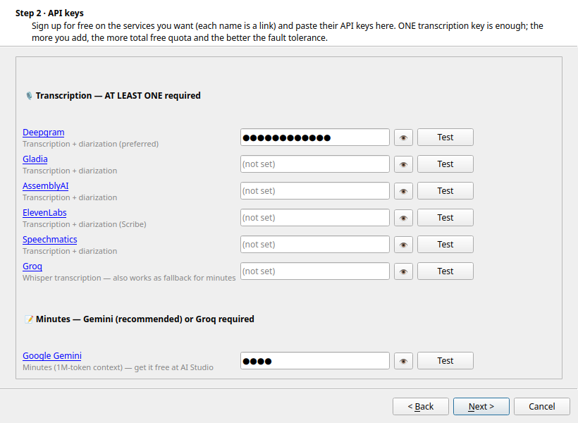

# Meet Transcriptions

> 🇦🇷 **[Documentación completa en español más abajo.](#meet-transcriptions-español)**

Automatic transcription of meeting recordings (Google Meet, Zoom, phone calls…). It watches a folder and, for every new audio/video file, generates a **speaker-diarized transcript** (VTT, TXT, JSON) and **AI-written meeting minutes** in Markdown — rotating across the **free tiers** of several transcription APIs (Deepgram, Gladia, AssemblyAI, ElevenLabs, Speechmatics, Groq) to dodge individual quota limits. Minutes are generated with Google Gemini (1M-token context) or Groq as fallback.

**Features**

- Desktop app for **Windows and Linux**: lives in the system tray, first-run wizard (checks/downloads ffmpeg, validates API keys, pins the recordings folder to the file explorer and Desktop), bilingual UI (English/Spanish, auto-detected).
- Detects new recordings via **native filesystem events** (inotify / ReadDirectoryChangesW — no polling) and waits until the file finishes copying.
- Tray icon shows configuration status at a glance (green/yellow/red badge) and notifies when each transcript + minutes are ready.
- **Automatic updates** with explicit user confirmation (checks GitHub Releases).
- Headless **CLI/cron mode** for servers.

| First-run wizard (API keys step) | Tray icon states |
|---|---|
|  |  |

**Download (Windows):** get the latest `MeetTranscriptions-Setup-*.exe` from the [Releases page](https://github.com/daxcoletti/meet-transcriptions/releases).

> ⚠️ The installer is not code-signed yet, so Windows SmartScreen will warn you: click **"More info" → "Run anyway"**. On Windows 11 with *Smart App Control* enabled there is no bypass — Smart App Control must be turned off to install unsigned apps.

**License:** [GNU GPL v3](LICENSE) (or, at your option, any later version).

---

# Meet Transcriptions (español)

Transcriptor automático de grabaciones de reuniones (Google Meet, Zoom, etc.) que rota entre varias APIs gratuitas para esquivar los límites de cuota individuales, genera transcripción con diarización (identificación de hablantes) y una **minuta** en Markdown.

**Descarga (Windows):** el instalador `MeetTranscriptions-Setup-*.exe` está en la [página de Releases](https://github.com/daxcoletti/meet-transcriptions/releases).

> ⚠️ El instalador todavía no está firmado digitalmente, así que SmartScreen va a avisar: clic en **"Más información" → "Ejecutar de todas formas"**. En Windows 11 con el *Control inteligente de aplicaciones* activado no hay bypass: hay que desactivarlo para instalar apps sin firma.

Funciona en **dos modos**:

- **App de escritorio** (Windows y Linux): vive en la bandeja del sistema, vigila la carpeta de grabaciones con eventos nativos del sistema de archivos (inotify / ReadDirectoryChangesW vía `watchdog`, sin polling) y procesa cada audio nuevo apenas termina de copiarse. Incluye un **wizard de primera ejecución** que verifica/descarga ffmpeg, pide las API keys (separando qué hace falta para transcribir y qué para la **minuta**: Gemini o Groq) y ofrece dejar la carpeta **anclada al explorador y con acceso directo en el Escritorio**, para que el drag & drop sea obvio. Interfaz **bilingüe** (castellano/inglés, auto-detecta el idioma del sistema). La ventana de **Configuración** permite cambiar todo después.
- **CLI por cron** (el modo histórico): una pasada por invocación; cada instancia toma un archivo, lo procesa y termina.

## Estructura

```
transcriptor/            paquete principal
├── engine.py            motor: segmentación, proveedores, diarización, minuta
├── config.py            config.json en ~/.config/MeetTranscriptions (o %APPDATA%)
├── watcher.py           vigilancia por eventos (watchdog) + worker
├── cli.py               modo cron (locks multiplataforma con filelock)
├── ffmpeg_utils.py      detección y descarga automática de ffmpeg
├── validators.py        prueba liviana de cada API key
├── autostart.py         arranque con la sesión (registro Run / autostart .desktop)
└── gui/                 PySide6: bandeja, wizard, configuración, registro
packaging/               PyInstaller (.spec) + Inno Setup (.iss) + ícono
super_transcriptor_v2.py wrapper de compatibilidad para el cron existente
```

## Cómo funciona

1. Escanea un directorio de audios (`/home/dax/Audios` por defecto).
2. Por cada archivo nuevo, extrae el audio con `ffmpeg` y lo divide en segmentos de 10 minutos (límite típico de las APIs gratuitas).
3. **Transcripción con diarización**: intenta cada segmento con **Deepgram** (`nova-3`) y, si falla, **Gladia**, luego **AssemblyAI**, **ElevenLabs** (Scribe) y **Speechmatics**. Devuelve *utterances* con hablante y timestamps.
4. **Fallback sin diarización**: si ningún proveedor de diarización está disponible o falla, cae a texto plano probando en orden **Groq** (`whisper-large-v3`) → **Gladia** → **Deepgram** → **AssemblyAI** → **ElevenLabs** → **Speechmatics**. Ante un `429 (rate limit)` salta al siguiente.
5. Une los segmentos y escribe la salida en `transcriptions/`:
   - `.vtt` (WebVTT, con hablantes si hubo diarización)
   - `.txt` (texto plano con timestamps)
   - `.json` (estructura completa: utterances o segmentos)
6. Genera una **minuta** en Markdown en `Minutas/` (ver abajo).
7. Mueve el original a `procesados/` y registra el nombre en `done_transcriptions.txt` para no repetir.

### Minuta: Gemini (primario) + Groq map-reduce (fallback)

- **Gemini 2.5 Flash (primario)**: si hay `gemini.key`, la minuta se genera en **una sola llamada** aprovechando su contexto de **1M tokens** — el transcript completo entra sin chunking, sin límites de TPM. Es el camino preferido (más simple y de mayor calidad).
- **Groq map-reduce (fallback)**: si no hay `gemini.key` o Gemini falla, se cae a Groq. Como su free tier tiene un límite de **tokens por minuto (TPM)** bajo (p.ej. 12.000 para `llama-3.3-70b-versatile`), mandar el transcript completo en una sola llamada fallaba con `413 Request too large` en reuniones de más de ~30 min. Para resolverlo se usa **map-reduce**:
  - **MAP**: el transcript se parte en trozos (~10k chars) y cada uno se condensa con un LLM, **rotando entre varios modelos** (`gpt-oss-120b`, `llama-4-scout`, `qwen3-32b`, `llama-3.3-70b`) para repartir el cupo TPM (cada modelo tiene su propio límite). Los `429` se reintentan respetando el `retry-after`.
  - **REDUCE**: se juntan los resúmenes (mucho más chicos) y se arma la minuta final en una sola llamada a un modelo fuerte. Si los resúmenes juntos todavía no entran, se condensan de nuevo (reduce jerárquico).
  - Transcripts cortos → una sola pasada directa.

El idioma de la minuta se detecta automáticamente con `langdetect`.

### Detección de archivos nuevos

- **App de escritorio**: `watchdog` se suscribe a los eventos nativos del sistema de archivos (inotify en Linux, ReadDirectoryChangesW en Windows), así no hay polling. Antes de procesar espera a que el tamaño del archivo se estabilice (las grabaciones se copian de a poco). Al arrancar hace un barrido único por si llegaron archivos con la app cerrada. Un solo hilo worker procesa en serie, así que no hacen falta locks.
- **Modo cron**: el script se ejecuta cada minuto. Para evitar que dos instancias procesen el mismo archivo (gastando cuota gratuita 2×) usa **locks por archivo** con `filelock` (multiplataforma):
  - Cada instancia toma **un único archivo**, lo procesa y termina.
  - Si hay un segundo archivo, la siguiente instancia (el próximo minuto, o una en paralelo) lo toma sin pisar el primero.
  - Los locks viven en `<tmp del sistema>/transcripcion_locks/<sha1>.lock` y se liberan al terminar (o al morir el proceso).

## Requisitos

- Windows o Linux con `ffmpeg` (en la app de escritorio, el wizard lo detecta y ofrece descargarlo automáticamente; en Linux también sirve `apt install ffmpeg`)
- Python 3.10+ (solo para correr desde código; el instalador de Windows ya incluye todo)
- Cuentas gratuitas en al menos uno de:
  - [Groq](https://console.groq.com/) (transcripción Whisper + LLM para la minuta)
  - [Gladia](https://www.gladia.io/) (transcripción + diarización)
  - [Deepgram](https://console.deepgram.com/) (transcripción + diarización)
  - [AssemblyAI](https://www.assemblyai.com/) (transcripción + diarización)
  - [ElevenLabs](https://elevenlabs.io/) (Scribe — transcripción + diarización)
  - [Speechmatics](https://www.speechmatics.com/) (transcripción + diarización; idioma fijo por job, ver `SPEECHMATICS_LANG`)
- Opcional para la minuta: [Google Gemini](https://aistudio.google.com/) (1M de contexto; primario si está presente)

## Instalación — App de escritorio

### Windows (instalador)

Descargar y ejecutar `MeetTranscriptions-Setup-<versión>.exe`. El instalador (Inno Setup, en español) no pide administrador. En el primer arranque, un asistente:

1. verifica **ffmpeg** y, si falta, ofrece **descargarlo con un clic** (no viene embebido en el instalador);
2. pide las **API keys** (cada servicio con su enlace de registro y botón «Probar» que valida la key);
3. deja elegir la **carpeta de grabaciones** y si arranca con Windows.

Para **construir** el instalador (en una máquina Windows):

```powershell
pip install ".[gui]" pyinstaller
python packaging\make_icon.py            # genera windows\icon.ico
pyinstaller packaging\transcriptor.spec  # genera dist\MeetTranscriptions\ (onedir)
# Compilar packaging\installer.iss con Inno Setup 6 → Output\MeetTranscriptions-Setup-*.exe
```

### Linux (app de escritorio)

```bash
pip install ".[gui]"      # o pipx install ".[gui]"
meet-transcriptions        # abre el wizard la primera vez y queda en la bandeja
```

Opcional: copiar `packaging/linux/meet-transcriptions.desktop` a `~/.local/share/applications/` para tenerla en el menú de aplicaciones. El arranque automático se activa desde la propia app (Configuración).

## Instalación — Modo CLI/cron (histórico)

```bash
git clone git@github.com:daxcoletti/meet-transcriptions.git
cd meet-transcriptions

python3 -m venv venv
source venv/bin/activate
pip install requests tqdm langdetect filelock platformdirs watchdog
```

## Configuración

La configuración vive en `config.json` dentro del directorio estándar del usuario (`~/.config/MeetTranscriptions/` en Linux, `%APPDATA%\MeetTranscriptions\` en Windows). La app de escritorio lo administra desde el wizard/Configuración; en modo CLI se puede editar a mano.

1. **API keys**: van en `config.json` (`"api_keys": {"groq": "...", ...}`). *Compatibilidad*: si no existe `config.json`, se leen los archivos legacy `<proveedor>.key` de la raíz del repo, como siempre:

   ```bash
   echo "tu-groq-api-key"       > groq.key
   echo "tu-gladia-api-key"     > gladia.key
   echo "tu-deepgram-api-key"   > deepgram.key
   echo "tu-assemblyai-api-key"   > assemblyai.key
   echo "tu-elevenlabs-api-key"   > elevenlabs.key
   echo "tu-speechmatics-api-key" > speechmatics.key
   echo "tu-gemini-api-key"       > gemini.key
   ```

   Solo hace falta tener al menos uno; los faltantes se omiten automáticamente. La diarización requiere key de Deepgram, Gladia, AssemblyAI, ElevenLabs o Speechmatics. La minuta usa Gemini si está (primario) y si no Groq (map-reduce).

2. **Rutas**: la carpeta vigilada se define en `config.json` (`"audios_dir"`); por defecto:

   ```python
   AUDIOS_DIR          = Path.home() / "Audios"
   TRANSCRIPTIONS_DIR  = AUDIOS_DIR / "transcriptions"
   PROCESSED_DIR       = AUDIOS_DIR / "procesados"
   MINUTAS_DIR         = AUDIOS_DIR / "Minutas"
   LOG_FILE            = AUDIOS_DIR / "done_transcriptions.txt"
   ```

   Las carpetas y el log se crean solos en la primera corrida.

## Uso manual (CLI)

```bash
source venv/bin/activate
python super_transcriptor_v2.py      # o: python -m transcriptor --cli
```

Procesa **un** archivo y termina (por diseño, para que múltiples instancias paralelas tomen distintos archivos). Los locks entre instancias son multiplataforma (`filelock`).

## Uso por cron (recomendado)

`run_transcription.sh` activa el venv y ejecuta el script. Agregarlo al cron (la redirección del log la maneja quien invoca):

```cron
* * * * * dax /home/dax/dev/meet-transcriptions/run_transcription.sh >> /home/dax/Audios/cron.log 2>&1
```

Con esto, cron lanza una instancia por minuto. Si todavía está corriendo la anterior, la nueva tomará el siguiente archivo libre o terminará silenciosamente diciendo que no hay nada por hacer.

## Salida

Para `Reunion 2026-04-28.mkv` se genera:

- `transcriptions/Reunion 2026-04-28.vtt` — WebVTT (con hablantes si hubo diarización)
- `transcriptions/Reunion 2026-04-28.txt` — texto plano con timestamps
- `transcriptions/Reunion 2026-04-28.json` — estructura completa
- `Minutas/Reunion 2026-04-28.md` — minuta en Markdown (vacío si no hay `groq.key` o falla el LLM)
- el archivo original se mueve a `procesados/`
- el nombre queda registrado en `done_transcriptions.txt`

### Progreso por instancia

Mientras una instancia procesa un audio va actualizando `progress/instancia_<pid>.json` (etapa, segmento actual, avisos). Al terminar sin errores lo borra; si falla, el JSON queda en disco con el detalle del error (incluido el traceback si fue una excepción inesperada). Un `progress/` vacío significa que no hay nada corriendo ni fallado.

## Errores comunes

- **`ffmpeg: not found`** → instalar con `apt install ffmpeg`.
- **La minuta sale vacía en reuniones largas** → era el bug de `413 Request too large` por el límite TPM; resuelto con el map-reduce (ver arriba). Verificar que `langdetect` esté instalado y que `groq.key` sea válida.
- **Cron no encuentra `python`** → usar `run_transcription.sh` que activa el venv, o poner la ruta absoluta al python del venv en el crontab.

## Licencia

[GNU GPL v3](LICENSE) (o, a tu opción, cualquier versión posterior). Software libre: podés usarlo, estudiarlo, modificarlo y redistribuirlo bajo los términos de la licencia.
